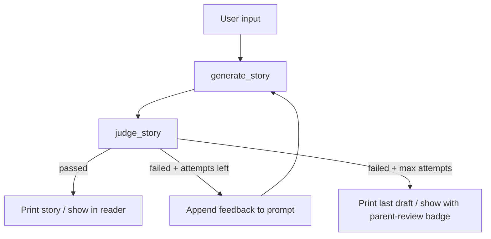

<p align="center">
  
</p>

<h1 align="center">🌙 Bedtime Story Generator</h1>

<p align="center">
  A prompt-driven pipeline that turns a child's story request into a safe, age-appropriate bedtime tale — reviewed by an LLM judge before it reaches the reader.
</p>

---

## Overview

This project fulfills the [Hippocratic AI](https://www.hippocraticai.com) coding assignment: given a bedtime story request, use prompting to tell a story appropriate for ages 5–10, with an **LLM judge** that improves quality and safety before output.

The core idea is **responsible AI for children** — a storyteller agent writes warm, cozy tales, and a separate judge acts as a safety gate. Failed drafts are sent back with feedback for revision (up to 3 attempts).

**Two ways to run it:**
- **Web app** (`app.py`) — structured form: three objects, child age (5–10), story length; chunked reader with read-aloud
- **CLI** (`main.py`) — free-text story request, prints result to the terminal

Both paths share the same pipeline in `pipeline.py`.

---

## System Flow

### Web app

1. **User input** — three objects of interest (or **Random ideas**), child age (5–10), and story length (short / medium / long).
2. **`build_story_request`** — turns form fields into a structured prompt for the storyteller.
3. **`generate_story`** — storyteller drafts a tale (`gpt-3.5-turbo`, temperature 0.8).
4. **`judge_story`** — judge reviews the draft (`gpt-3.5-turbo`, temperature 0.2).
5. **If passed** → story shown in the web reader with an “Approved for bedtime” badge.
6. **If failed and attempts remain** → judge feedback appended to the prompt → back to step 3 (max 3 attempts).
7. **If failed and max attempts reached** → last draft shown with a “Draft (review with a parent)” badge.

### CLI

Same steps 3–7, but step 1 is a single free-text prompt and step 7 prints to the terminal.

---

## Block Diagram

Core generate → judge → retry loop (shared by web and CLI):



**Web-only steps before the loop:** form → `POST /api/generate` → `build_story_request` → enters at `generate_story`.

**LLM calls:** both `generate_story` and `judge_story` go through `llm.py` → OpenAI API (`gpt-3.5-turbo`).

### Prompt flow

| Step | Module | What gets sent |
|------|--------|----------------|
| 1 | `storyteller.py` system | Bedtime voice, safety rules, 4-part story arc, output format |
| 2 | `storyteller.py` user | Story request — objects/age/length from web, or free text from CLI (+ judge feedback on retries) |
| 3 | `judge.py` system | Strict child-safety reviewer persona |
| 4 | `judge.py` user | Safety checklist (+ target age & length when provided) + full story → JSON `{ "passed", "feedback" }` |

### Judge criteria

- Age-appropriate vocabulary and themes (no romance, politics, religion, adult topics)
- Emotionally safe (no violence, fear, monsters, distressing situations)
- Clear peaceful ending
- **When provided:** language suits the target age (5–10)
- **When provided:** story length matches short (~200w), medium (~350w), or long (~500w)

---

## Project Structure

```
Bedtime Story Generator/
├── app.py                 # Flask server — form UI + /api/generate
├── main.py                # CLI entry point
├── pipeline.py            # build_story_request, generate_story_with_judge
├── storyteller.py         # Story generation prompts
├── judge.py               # Safety review + JSON pass/fail
├── llm.py                 # OpenAI client (gpt-3.5-turbo)
├── requirements.txt
├── .env.example
├── assets/
│   └── header.png         # README banner (add your own)
└── web/
    ├── templates/
    │   └── index.html     # Setup form + chunked story reader
    └── static/
        ├── css/style.css  # Bedtime theme (stars, moon, dark purple palette)
        └── js/app.js      # Random objects, API, read-aloud highlighting
```

| File | Role |
|------|------|
| `pipeline.py` | Shared retry loop; returns `{ story, passed, attempts, feedback }` |
| `app.py` | Validates form input, calls pipeline, returns JSON |
| `main.py` | Interactive CLI wrapper around the same pipeline |
| `web/static/js/app.js` | Splits story into 2-sentence chunks; Web Speech API read-aloud with word highlighting |

---

## Setup & Run

**Requirements:** Python 3.10+, OpenAI API key.

```bash
pip install -r requirements.txt
cp .env.example .env
```

Edit `.env`:

```bash
# Submission (required)
USE_GROQ=false
OPENAI_API_KEY=your_openai_api_key_here

# Optional local testing with Groq free tier
# USE_GROQ=true
# GROQ_API_KEY=your_groq_api_key_here
```

### Web app (recommended)

```bash
python app.py
```

Open **http://localhost:5000**. Pick three objects, set age and length, then **Generate story**. The reader shows two sentences at a time in large type; **Read aloud** uses browser speech synthesis with word-by-word highlighting (works best in Chrome or Safari).

### CLI

```bash
python main.py
```

Example prompt: *"A story about a girl named Alice and her best friend Bob, who happens to be a cat."*

---

## Live demo for graders

The easiest way for reviewers to try the app is a **public URL** — no local setup required.

### Deploy to Render (free)

1. Push this repo to GitHub (if you have not already).
2. Go to [render.com](https://render.com) → **New** → **Blueprint** (or **Web Service**).
3. Connect your GitHub repo. If using Blueprint, Render reads `render.yaml` automatically.
4. Set environment variables:
   - `USE_GROQ` = `false` (uses `gpt-3.5-turbo` as required)
   - `OPENAI_API_KEY` = your OpenAI key (stored as a secret on Render, never in git)
5. Deploy. Render gives you a URL like `https://bedtime-story-generator.onrender.com`.
6. **Include that URL in your assignment submission** so graders can open the form and generate stories.

**Notes for graders:** The free Render tier may sleep after ~15 minutes of inactivity; the first request after that can take 30–60 seconds to wake up. Story generation itself usually takes 10–30 seconds (storyteller + judge, with possible retries).

**Protect your API spend:** Set a monthly usage limit in your [OpenAI dashboard](https://platform.openai.com/settings/organization/limits) before sharing the link publicly.

### Run locally (alternative)

Graders can also clone the repo and follow [Setup & Run](#setup--run) above with their own API key.

---

## API (web)

**`POST /api/generate`**

Request body:

```json
{
  "object1": "a red balloon",
  "object2": "a friendly owl",
  "object3": "a warm blanket",
  "age": 7,
  "length": "medium"
}
```

Response:

```json
{
  "story": "...",
  "passed": true,
  "attempts": 1,
  "feedback": "..."
}
```

---

## Design Choices

- **Two-agent pattern** — generation and evaluation are separate LLM calls with different system prompts and temperatures (storyteller: 0.8, judge: 0.2).
- **Safety-first judge** — criteria focus on child safety, not literary criticism; age and length are checked when the web form supplies them.
- **Structured retry** — judge feedback is injected into the storyteller user prompt so revisions are targeted.
- **Story arc prompting** — setup → gentle adventure → peaceful resolution → sleepy ending.
- **Bedtime reader UX** — 2-sentence chunks, optional read-aloud, and a badge when the judge did not fully approve.

---

## Header Image

Add a wide banner at **`assets/header.png`** (~1200×400 px). The README references it at the top — once saved, it renders on GitHub. A moonlit forest with friendly animals (owls, foxes, monkeys in trees) fits the bedtime theme.
